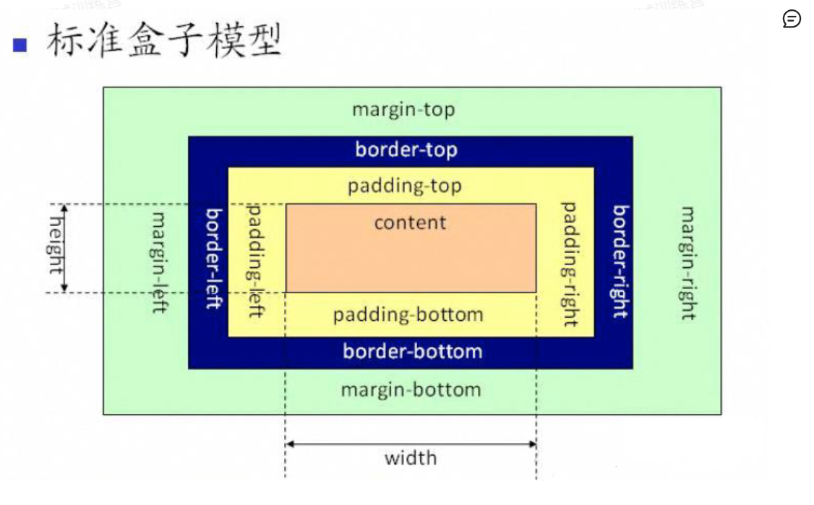

# 对盒模型的理解

CSS3中的盒模型有以下两种：标准盒子模型、IE盒子模型



盒模型的英语名词为**CSS basic box model**，每个盒子由四个部分（或称*区域*）组成，*内容边界* *Content edge*、*内边距边界* *Padding Edge*、*边框边界* *Border Edge*、*外边框边界* *Margin Edge*。

标准盒模型和IE盒模型的区别在于设置width和height时，所对应的范围不同：  

● 标准盒模型的width和height属性的范围只包含了content， 

● IE盒模型的width和height属性的范围包含了border、**padding**和**content**。 


 可以通过修改元素的box-sizing属性来改变元素的盒模型：  

● box-sizeing: content-box表示标准盒模型（默认值）

 ● box-sizeing: border-box表示IE盒模型（怪异盒模型）


# 页面布局


# 常见的css布局单位

常用的布局单位包括像素（px），百分比（%），em，rem，vw/vh。  

（1）像素（px）是页面布局的基础，一个像素表示终端（电脑、手机、平板等）屏幕所能显示的最小的区域，像素分为两种类型：CSS像素和物理像素：  

● CSS像素：为web开发者提供，在CSS中使用的一个抽象单位；

 ● 物理像素：只与设备的硬件密度有关，任何设备的物理像素都是固定的。  

（2）百分比（%），当浏览器的宽度或者高度发生变化时，通过百分比单位可以使得浏览器中的组件的宽和高随着浏览器的变化而变化，从而实现响应式的效果。一般认为子元素的百分比相对于直接父元素。  

（3）em和rem相对于px更具灵活性，它们都是相对长度单位，它们之间的区别：em相对于父元素，rem相对于根元素。 

 ● em： 文本相对长度单位。相对于当前对象内文本的字体尺寸。如果当前行内文本的字体尺寸未被人为设置，则相对于浏览器的默认字体尺寸(默认16px)。(相对**父元素的字体大小倍数**)。 

● rem： rem是CSS3新增的一个相对单位，相对于根元素（html元素）的font-size的倍数。作用：利用rem可以实现简单的响应式布局，可以利用html元素中字体的大小与屏幕间的比值来设置font-size的值，以此实现当屏幕分辨率变化时让元素也随之变化。  

（4）vw/vh是与视图窗口有关的单位，vw表示相对于视图窗口的宽度，vh表示相对于视图窗口高度，除了vw和vh外，还有vmin和vmax两个相关的单位。

 ● vw：相对于视窗的宽度，视窗宽度是100vw； 

● vh：相对于视窗的高度，视窗高度是100vh； 

● vmin：vw和vh中的较小值； ● vmax：vw和vh中的较大值；  vw/vh 和百分比很类似，两者的区别：  ● 百分比（%）：大部分相对于祖先元素，也有相对于自身的情况比如（border-radius、translate等) ● vw/vm：相对于视窗的尺寸


## em 和 rem

em： 文本相对长度单位。相对于当前对象内文本的字体尺寸（也就是font-size属性），这个相对长度存在一个优先级，第一优先级为自身，

他是相相对**父元素的字体大小倍数**)。 比如在这里例子中，举个例子，当一个标签设置了font-size属性值，那么其嵌套的子元素和自身在使用em单位时，都会继承这个字体值。如果是16那么1em就是16。还有一种情况就是，如果你的body也设置了字体（比如16），然后你的div标签的font-size属性是用em单位，那么他的值就会根据body的值进行计算。然后div的font-size就变成了16*1.2。而div设置的其他值，比如，padding，margin，就会根据当前div的font-size的值进行计算。

```css
 .padded {
    font-size: 16px;
    padding: 1em;
    width: 10em;
    height: 10em;
  }

em的值会相对与第一个px的值。
```

好处在于可以定义一个元素的大小，然后只需要改变字号就能整体缩放元素。


### 存在的问题

如果我们用em设置嵌套标签时，就会出现每个每层em的值不一样的情况。比如嵌套的列表。而rem就是为了解决这个问题。rem 不是相对于当前元素，而是相对于根元素的单位。也就是说，不管在文档的哪个位置使用rem，所计算出的值都是固定的。


px、em、rem的区别及使用场景  三者的区别：

  ● px是固定的像素，一旦设置了就无法因为适应页面大小而改变。 

● em和rem相对于px更具有灵活性，他们是**相对长度单位**，其长度不是固定的，更适用于响应式布局。

 ● em是相对于其**父元素**来设置字体大小，这样就会存在一个问题，进行任何元素设置，都有可能需要知道他父元素的大小。而rem是相对于**根元素**，这样就意味着，只需要在根元素确定一个参考值。  

```HTML
<!DOCTYPE html>
<html lang="en">
<head>
    <meta charset="UTF-8">
    <meta name="viewport" content="width=device-width, initial-scale=1.0">
    <style>
        body {
            font-size: 16px; /* 根元素的字体大小 */
        }
        .parent {
            font-size: 2em; /* 父元素的字体大小是根元素的两倍 */
        }
        .child {
            font-size: 1em; /* 子元素的字体大小是相对于父元素的字体大小 */
        }
    </style>
</head>
<body>
    <div class="parent">
        <div class="child">我是子元素</div>
    </div>
</body>
</html>

```

比如我们把body标签的字体大小设置为16px，创建两个盒子分别为parent和child。parent盒子就继承了父元素也就是body标签字体大小16px. 1em等于16，以此类推。rem是相对于根元素，也是16.


### 使用场景

我一般会用 rem 设置字号，用 px 设置边框，用 em 设置

其他大部分属性，尤其是内边距、外边距和圆角（不过我有时用百分比设置容器宽度）。


## 2.2 视口的相对单位（38页）

浏览器视口定义长度的视口的相对单位。视口——浏览器窗口里网页可见部分的边框区域。它不包括浏览器的地址栏、工具栏、状态栏。

vh：视口高度的 1/100。

 vw：视口宽度的 1/100。

 vmin：视口宽、高中较小的一方的 1/100（IE9 中叫 vm，而不是 vmin）。

 vmax：视口宽、高中较大的一方的 1/100（本书写作时IE和Edge均不支持vmax）①。

比如，50vw 等于视口宽度的一半，25vh 等于视口高度的 25%。vmin 取决于宽和高中较小的一方，这可以保证元素在屏幕方向变化时适应屏幕。在横屏时，vmin 取决于高度；在竖屏时，则取决于宽度。


# 响应式布局 媒体查询

```css
   :root {
      font-size: 0.75em;
    }
    @media (min-width: 800px) {
      :root {
        font-size: 0.875em;
      }
    }
    @media (min-width: 1200px) {
      :root {
        font-size: 1em;
      }
    }
```


# 水平垂直居中的实现

利用绝对定位有两种方式，第一种先将元素的左上角通过top:50%和left:50%定位到页面的中心，然后再通过translate来调整元素的中心点到页面的中心。该方法需要考虑**浏览器兼容问题**。

```
.parent {     position: relative; }   

.child {     position: absolute;     left: 50%;     top: 50%;     transform: translate(-50%,-50%); }
```


利用绝对定位，设置四个方向的值都为0，并将margin设置为auto，由于宽高固定，因此对应方向实现平分，可以实现水平和垂直方向上的居中。该方法适用于盒子有宽高的情况：

```
.parent {     position: relative; }   

.child {     position: absolute;     top: 0;     bottom: 0;     left: 0;     right: 0;     margin: auto; }
```


使用flex布局，通过align-items:center和justify-content:center设置容器的垂直和水平方向上为居中对齐，然后它的子元素也可以实现垂直和水平的居中。该方法要考虑兼容的问题，该方法在移动端用的较多：

```
.parent {     display: flex;     justify-content:center;     align-items:center; }
```


# 对flex布局的理解及其使用场景

Flex是FlexibleBox的缩写，意为"弹性布局"，用来为盒状模型提供最大的灵活性。任何一个容器都可以指定为Flex布局。行内元素也可以使用Flex布局。设为Flex布局以后，子元素的**float**、**clear**和vertical-align属性将失效。

采用Flex布局的元素，称为Flex容器（flex container），简称"容器"。

所有**子元素**自动成为容器成员，称为Flex项目（flex item），简称"项目"。

容器默认存在两根轴：水平的主轴（main axis）和垂直的交叉轴（cross axis），项目默认沿水平主轴排列。


以下6个属性设置在**容器上**：  

● flex-direction属性决定主轴的方向（即项目的排列方向）从左到右还是从右到左。

 ● flex-wrap属性定义，如果一条轴线排不下，如何换行。

 ● flex-flow属性是flex-direction属性和flex-wrap属性的简写形式，默认值为row nowrap。 

● justify-content属性定义了项目在**主轴上**的**对齐方式**。 ● align-items属性定义项目在交叉轴上如何对齐。 

● align-content属性定义了多根轴线的对齐方式。如果项目只有一根轴线，该属性不起作用。  


以下6个属性设置在**项目上**：  

● order属性定义项目的排列顺序。数值越小，排列越靠前，默认为0。

 ● flex-grow属性定义项目的放大比例，默认为0，即如果存在剩余空间，也不放大。 

● flex-shrink属性定义了项目的缩小比例，默认为1，即如果空间不足，该项目将缩小。

 ● flex-basis属性定义了在分配多余空间之前，项目占据的主轴空间。浏览器根据这个属性，计算主轴是否有多余空间。它的默认值为auto，即项目的本来大小。 

● flex属性是flex-grow，flex-shrink和flex-basis的简写，默认值为0 1 auto。

 ● align-self属性允许单个项目有与其他项目不一样的对齐方式，可覆盖align-items属性。默认值为auto，表示继承父元素的align-items属性，如果没有父元素，则等同于stretch。